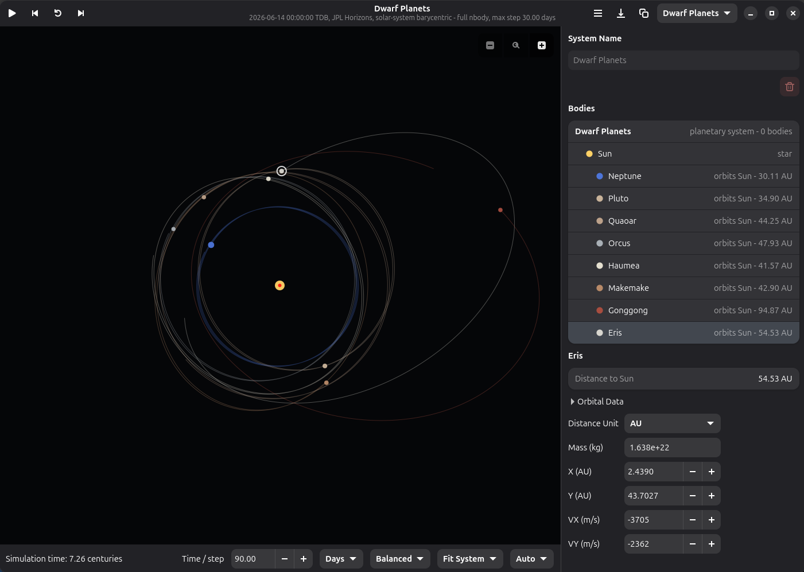
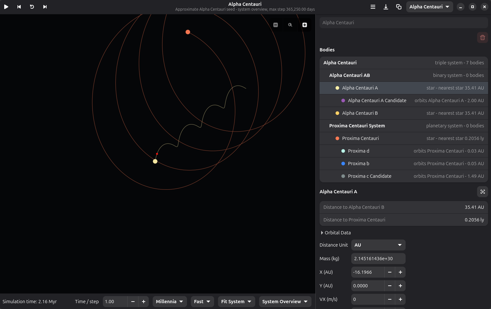

# Solar System Builder

Solar System Builder is a Python GNOME  / GTK4 / Libadwaita application for configuring and simulating solar systems. It currently provides a 2D top-down orbital view, a bundled Solar System preset, editable body parameters, local JSON persistence, and a NumPy-backed physics core with a first post-Newtonian approximation.

## Using the App

Use the canvas to inspect bodies, select objects, view trails, and zoom into the active simulation. The controls below the canvas set the visible time step, accuracy profile, view mode, and simulation scope. The right sidebar switches systems, saves or duplicates them, and edits the selected body's mass, position, and velocity.

For a full guide to the canvas controls and simulation settings, see `docs/USER_INTERFACE.md`.

## TODO

The current simulator comes with 3 preset systems. The Solar System with the official 8 planets, the Solar System largest Dwarf Planets, and the Alpha Centauri System.

In the future I will add the user interface to add your own complex systems. 

## Screenshots






## Development

Configure and test with Meson:

```sh
meson setup builddir
meson test -C builddir
```

Run the Python unit tests directly:

```sh
python3 -m unittest discover -s tests
```

GNOME Builder runs the app inside the Flatpak sandbox described by `io.github.jackrabbithanna.solarsystembuilder.json`. NumPy is installed by an inline Flatpak module in that manifest.

## Documentation

Start with:

- `docs/USER_INTERFACE.md`
- `docs/ORBITAL_DATA.md`
- `docs/PHYSICS.md`
