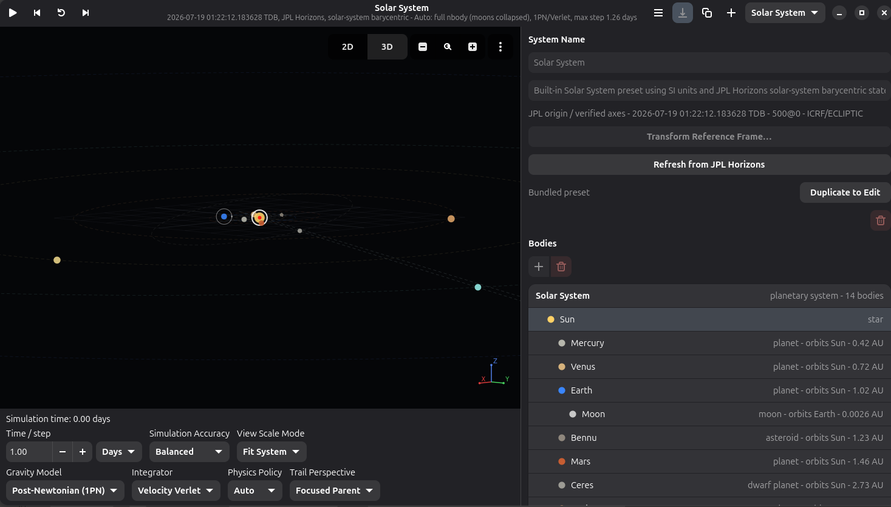

# Solar System Builder

Solar System Builder is a GNOME desktop application for creating, exploring, and simulating planetary and multi-star systems. Start from a bundled system, build one from scratch, or import current Solar System bodies from JPL Horizons, then inspect how the system evolves under gravity.

The model stores complete three-dimensional positions and velocities in SI units. The current canvas presents those systems as an interactive top-down 2D view, making the app useful for visual exploration and simulation experiments rather than precision navigation or mission planning.

## Features

- Explore bundled Solar System, dwarf-planet, and Alpha Centauri presets.
- Create single-star, binary-star, and hierarchical systems, then save editable copies in a local JSON library.
- Add and organize stars, planets, dwarf planets, moons, comets, asteroids, nested system groups, and persistent unbound flybys.
- Edit complete Cartesian state vectors or generate them from elliptic and hyperbolic orbital elements.
- Search JPL Horizons for bodies, import available physical data, and atomically refresh an entire compatible system to one current epoch.
- Convert verified ICRF, equatorial, ecliptic, and Galactic frames with time-scale-aware epoch propagation, precession/nutation, and JPL-backed origin changes.
- Inspect the canvas in translating, prescribed-rotation, axes-of-date, or target-pair co-rotating analysis frames without changing the canonical inertial simulation.
- Run NumPy-backed N-body playback with Newtonian or first post-Newtonian gravity, Velocity Verlet or RK4 integration, bounded internal substeps, and scalable focus or barycenter approximation policies.
- Follow selected bodies and systems, focus on planet-and-moon subsystems, use logarithmic overviews, and compare focused motion with coarse outside context.
- Inspect barycenters, distances, orbital trails, elapsed simulation time, explicit non-inertial acceleration terms, reference-frame provenance, and saved simulation settings.
- Export importable JSON snapshots centered on a body, subsystem, or system barycenter, or export relative diagnostics as CSV.

## Using the App

Use the canvas to select bodies, inspect trails, and zoom through the active system. Playback controls step or continuously advance simulated time. The settings below the canvas control the visible time interval, integration accuracy, gravity model, integrator, view scale, physics policy, and trail perspective. The main menu provides an on-demand conservation-diagnostics snapshot for debugging.

The sidebar switches between bundled and saved systems, exposes the body and group hierarchy, and provides creation, editing, orbital-generation, and JPL tools. Bundled presets are read-only; duplicate one when you want to edit or save changes.

For a complete guide, see the [User Interface documentation](./docs/USER_INTERFACE.md).

## Screenshots

### Solar System overview



### Focus and Fit

> Screenshot placeholder — capture a focused planet-and-moon subsystem with focused-parent trails and the outside-context inset visible. Suggested file: `screenshots/focus-and-fit.png`.

### Building a system

> Screenshot placeholder — capture the system editor, body creation workflow, or JPL Horizons review dialog. Suggested file: `screenshots/system-editor-horizons.png`.

## Development

### Prerequisites

GNOME Builder provides the SDK used to build and run the application. For host-side tests on Debian or Ubuntu, install Python virtual-environment support, PyGObject, and Gettext (`msgfmt`):

```sh
sudo apt install python3-venv python3-gi gettext
```

Equivalent package names can be used on other Linux distributions.

### Host Test Environment

From the repository root, create a virtual environment using the system Python and install the pinned numerical and astronomy dependencies plus the Meson test tools:

```sh
/usr/bin/python3 -m venv --system-site-packages .venv
. .venv/bin/activate
python -m pip install -r requirements.txt
python -m pip install meson ninja
```

`--system-site-packages` makes the distribution-provided PyGObject bindings available without installing GTK bindings from PyPI. Activate the environment again with `. .venv/bin/activate` when starting a new terminal session.

Run the Python test suite directly:

```sh
python -m unittest discover -s tests
```

Then configure the Meson build directory and run its registered tests:

```sh
meson setup builddir
meson test -C builddir
```

After the initial setup, use `meson setup --reconfigure builddir` when Meson files or build options change. Run both test commands after changes that affect behavior or packaging.

### Build and Run with GNOME Builder

1. Open the repository directory in GNOME Builder.
2. Select the Flatpak build configuration from `io.github.jackrabbithanna.solarsystembuilder.json` if Builder asks for a configuration.
3. Allow Builder to install the matching GNOME 49 SDK and Platform runtimes when prompted.
4. Use **Build and Run** to build, install, and launch the application in its Flatpak sandbox.

Use a clean rebuild after changing the Flatpak manifest or its dependency modules. NumPy, Astropy, PyERFA, and the offline IERS data are installed inside the sandbox by the manifest; packages installed in the host virtual environment are only for local tests and are not visible to the Flatpak application.

Additional packaging details are in [Flatpak and NumPy](./docs/FLATPAK_AND_NUMPY.md).

## Documentation

Start with:

- [User Interface](./docs/USER_INTERFACE.md)
- [Reference Frames and Coordinate Transformations](./docs/REFERENCE_FRAMES.md)
- [Orbital Data](./docs/ORBITAL_DATA.md)
- [Physics](./docs/PHYSICS.md)
